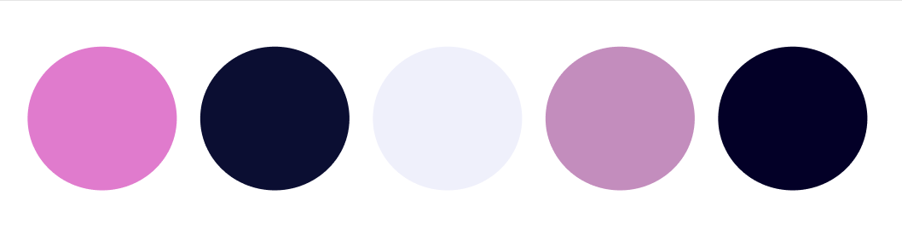

# Imparables E-learning

Imparables E-learning es una plataforma de aprendizaje online enfocada en la enseñanza por medio de video tutoriales de tecnologias de desarrollo como HTML, CSS, 
JAVA SCRIPT y BASE DE DATOS.

## Esctructura
Nuestra aplicación se compone de una pagina principal, una sección de cursos, un formulario de inscripción y un login para iniciar sesion. En el apartado de cada
curso insertamos los videos de cada lección, junto a una barra de progreso que mide el avance por clase y cuenta con una autoevaluación para realizar cuando
finalice de ver los contenidos.

## Herramientas utilizadas
* [Figma](https://www.figma.com/best-practices/guide-to-developer-handoff/components-styles-and-documentation/) - Wireframe y diseño de la página
* [HTML](https://developer.mozilla.org/es/docs/Web/HTML) - Lenguaje de etiquetado
* [CSS](https://www.w3.org/Style/CSS/Overview.en.html) - Lenguaje de estilos
* [JavaScript](https://developer.mozilla.org/es/docs/Web/JavaScript) - Lenguaje para darle interactividad al sitio
* [SASS](https://sass-lang.com/) - Preprocesador de CSS

## Paleta de colores

| colores en Hexadecimal   |
| -------------------- |
|    #E07BCD     |
|    #0B0E32     |
|    #EFF0FB     |
|    #C38DBD     |
|    #030027     |

## Tipografía
@import url('https://fonts.googleapis.com/css2?family=Roboto:wght@100&display=swap')

 'Roboto', sans-serif

## Páginas en las que nos inspiramos

* [Crehana](https://www.crehana.com/ar/) - Plataforma de desarrollo de talento que ayuda a organizaciones y personas a ser más competitivas
* [CoderHouse](https://www.coderhouse.com/) - Comunidad de aprendizaje online en vivo
* [Platzi](https://platzi.com/) - Plataforma de aprendizaje desde cero o especialización en las áreas más demandadas del trabajo digital
* [Udemy](https://www.udemy.com/) - Página que ofrece tanto cursos gratis como de pago
* [Educacion IT](https://www.educacionit.com/) - Plataforma que ofrece cursos de pago en tecnología
* [Digital House](https://www.digitalhouse.com/ar) - Plataforma que ofrece cursos, programas y carreras de pago en tecnología

_Nos inspiramos en estas páginas, ya que son las más conocidas que ofrecen cursos de programación_

## Link para visualizar primera Sprint Review:

https://docs.google.com/presentation/d/1eeWuTqNInK_vSxZkx87lGBTAXdTbE3t9NmRmV0bUYIo/edit?usp=sharing

- Wireframe
- Repositorio 
- Maquetado
- Testing

## Autores ✒️
* **Carolina Calónico** - *Página de cursos, detalle de curso CSS y testing* - [caritocalonico](https://github.com/caritocalonico)
* **Daniela Londoño** - *Register, detalle de curso Base de Datos y accesibilidad* - [DanielaArbi](https://github.com/DanielaArbi)
* **Joaquín Delgado** - *Login y detalle de curso HTML* - [Joaquin-Zanoni](https://github.com/Joaquin-Zanoni)
* **Micaela Casebonne** - *Diseño, index y header* - [Micasebonne12](https://github.com/Micasebonne12)
* **Soledad Vallejos** - *Detalle de cursos JavaScript y revisión de textos en todas las páginas de cursos* - [MSoledadVallejos](https://github.com/MSoledadVallejos)
* **Kevin Áviles (ex integrante)** - *Footer y header responsive* - [kevin-Bejarano-Aviles](https://github.com/kevin-Bejarano-Aviles)

⌨️ con ❤️ por [Todo el equipo de célula]() 😊
